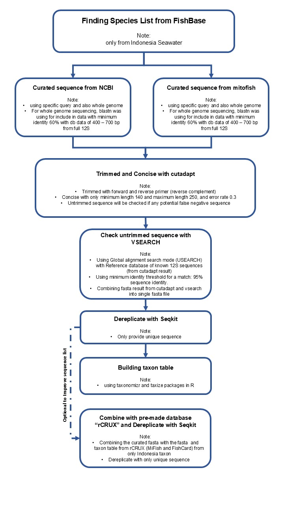

# Curated Metabarcoding Database for Marine Fish in Indonesia

This curated reference database is based on the 12S MiFish region and includes only marine fish species (Actinopteri and Chondrichthyes) found in Indonesian waters, specifically designed for use in eDNA and metabarcoding studies. We provide two versions of the database:

* LocalDB – a curated dataset containing marine fish taxa recorded in Indonesia, compiled from NCBI and MitoFish. [link](https://github.com/mdaniealmalik/Curated-Metabarcoding-Database-for-Marine-Fish-in-Indonesia/tree/main/database_local)

* LocalDB + Pre-made – a combined database that merges LocalDB with additional curated references, including publicly available databases such as rCRUX (12S MiFish) and FishCARD (Gold et al., 2023). [link](https://github.com/mdaniealmalik/Curated-Metabarcoding-Database-for-Marine-Fish-in-Indonesia/tree/main/database_local_plus_premade)

The workflow used to construct these curated databases is illustrated in the figure below:

Acknowledgments:

This research was funded by the Sophie Danforth Conservation Biology Fund.

References:

Gold, Z., Curd, E., Gal, L., Gallego, R., Nielsen, S., & Silliman, K. (2023). RCRUX generated MiFISH Universal 12S expanded +FishCARD Reference Database [Dataset]. In Zenodo (CERN European Organization for Nuclear Research). https://doi.org/10.5281/zenodo.8409239
