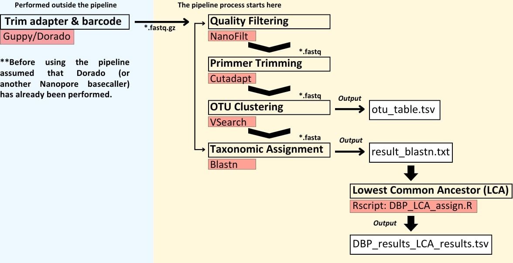

[](https://doi.org/10.1016/j.rsma.2026.104868)

# **DBP Metabarcoding Pipeline**

## 🚀 Introduction

**DBP Metabarcoding Pipeline v2**: an open tool for Nanopore metabarcoding data, built to support eDNA *biodiversity research*, *monitoring*, and *learning* in **Indonesia**. 

*This [link](https://www.protocols.io/view/dbp-metabarcoding-pipeline-for-metabarcoding-data-j8nlk94rxv5r/v1) is the archive for DBP Metabarcoding Pipeline v1.*

Please note that before using this pipeline, it is assumed that Dorado (or another Nanopore basecaller) has already performed:

- ✅ Basecalling  
- ✅ Demultiplexing (per-sample FASTQ files)  
- ✅ Adapter and barcode removal  

## 🧬 Pipeline Workflow  



The pipeline proceeds with the following steps:

1. **Quality Filtering** – remove low-quality or too short/long reads  
   - Tool: `NanoFilt`  

2. **Primer Trimming** – remove amplification primers  
   - Tool: `Cutadapt`  

3. **OTU Clustering** – dereplicate, cluster, remove singleton, and remove chimeras  
   - Tool: `VSEARCH`  

4. **Taxonomic Assignment** – assign sequences to reference database
   - Tool: `BLASTn`
   - Perform `Lowest Common Ancestor (LCA)` estimation from BLASTN results

The pipeline **results** – generate:  
   - `otu_table.tsv` (OTU abundance table)  
   - `result_blastn.txt` (BLAST taxonomy result)
   - `DBP_results_LCA_results.tsv` (LCA result)

## 💻 Installation (Step by Step)
Before setting up the pipeline, ensure that [Conda](https://docs.conda.io/projects/conda/en/latest/user-guide/install/index.html) or [Miniconda](https://www.anaconda.com/docs/getting-started/miniconda/install) is installed, as the pipeline runs within a Conda environment.

**Clone the repository**  
```bash
git clone https://github.com/mdaniealmalik/DBP_pipeline_nanopore_metabarcoding.git
```
```bash
cd DBP_pipeline_nanopore_metabarcoding
```

**Create and activate the conda environment**
```bash
conda env create -f  environment.yml
```
```bash
conda activate dbp_pipeline
```

**Make the pipeline script executable**
```bash
chmod +x bin/DBP_run_pipeline_v2
```

## 📁 Project Folder Structure

When preparing your files for the pipeline, your working directory should be organized as follows:

```graphql
MyProject/
├── 1_Sample/                       # Raw input FASTQ files (gzip-compressed)
│   ├── sample1.fastq.gz
│   ├── sample2.fastq.gz
│   └── sample3.fastq.gz
│
├── database/                       # Reference database for BLAST
│   └── database.fasta              # Custom or curated reference sequences (only accession number at the header)
│   └── database.txt                # Custom or curated reference taxon names (Accession number and taxon information) 
│
├── DBP_run_pipeline_v2             # Pipeline script (make sure it's executable)
├── DBP_LCA_assign.R                # R script for LCA
│
├── 2_NanoFilt_output/              # (Auto-generated) Quality filtered reads
├── 3_cutadapt_output/              # (Auto-generated) Primer-trimmed reads
├── 4_combined_fasta/               # (Auto-generated) FASTA converted reads
├── 5_vsearch/                      # (Auto-generated) VSEARCH results
│   ├── rename_fasta/
│   └── combine/
│
├── otu_table.tsv                   # (Auto-generated) OTU abundance table
└── result_blastn.txt               # (Auto-generated) BLAST taxonomic assignments
└── DBP_results_LCA_results.tsv     # (Auto-generated) LCA result
```
You can use the data structure in [my example data and database](https://github.com/mdaniealmalik/DBP_pipeline_nanopore_metabarcoding/tree/main/MyProject) to try this pipeline, and before trying it on your real datasets. 

## 📚 Database
This pipeline requires a reference database with **BLASTn** for taxonomic assignment.  
Place your reference FASTA file in the folder `database/`:  
- The pipeline will automatically create BLAST indices (`.nin`, `.nhr`, `.nsq`) from this FASTA file.  

You may use:
- A curated database (e.g., **MitoFish 12S**, **NCBI RefSeq**)  
- A custom database built from your target taxa

🐟 We have prepared a curated sequence database (Indonesian Marine Fish Sequences or I-MarFish) for a data sequence fit for MiFish, containing only marine fish species from Indonesia. Please visit [this link](https://github.com/mdaniealmalik/DBP_pipeline_nanopore_metabarcoding/tree/main/Curated-Metabarcoding-Database-for-Marine-Fish-in-Indonesia) to download the database and view details of the curation process.

⚠️ Make sure the file is named `database.fasta` and stored inside the `database/` folder before running the pipeline.

## ▶️ Usage
Before running the pipeline on your dataset, copy the file `DBP_run_pipeline_v2.sh` and `DBP_LCA_assign.R` from the `bin` folder into your dataset folder (e.g., `MyProject`), and then navigate into the `MyProject` directory.

```bash
cp bin/DBP_run_pipeline_v2 MyProject/DBP_run_pipeline_v2
```
```bash
cp bin/DBP_LCA_assign.R MyProject/DBP_LCA_assign.R
```

```bash
cd MyProject
```
Run with default parameters:
```bash
bash DBP_run_pipeline_v2
```

Or customise parameters:
```bash
bash DBP_run_pipeline_v2 \
  -q 12 -l 200 -L 320 \
  --primer-fwd "TTTCTGTTGGTGCTGATATTGCGCCGGTAAAACTCGTGCCAGC" \
  --primer-rev "ACTTGCCTGTCGCTCTATCTTCCATAGTGGGGTATCTAATCCCAGTTTG" \
  --cutadapt-error 0.2 \
  --cutadapt-minlen 160 \
  --cutadapt-maxlen 220 \
  --minsize 1 \
  --vsearch-id 0.97 \
  --blast-evalue 0.001 \
  --blast-identity 93 \
  --blast-qcov 95 \
  --blast-max-target 25\
  -t 8
```
**Note**: Sometimes the native barcode includes an overhang with the primer, so make sure to input the primer sequence with the overhang.

Parameter information:
| Tool         | Parameter              | Description                    |
| ------------ | ---------------------- | ------------------------------ |
| **NanoFilt** | `-q`                   | Min Phred quality score (**Default: 12**)       |
|              | `-l`                   | Min read length (**Default: 180**)               |
|              | `-L`                   | Max read length (**Default: 320**)               |
| **Cutadapt** | `--primer-fwd`         | Forward primer sequence  (**Default: overhang + Mifish-U**)      |
|              | `--primer-rev`         | Reverse primer sequence  (**Default: overhang + Mifish-U**)      |
|              | `--cutadapt-error`     | Max allowed primer mismatch  (**Default: 0.2**)  |
|              | `--cutadapt-minlen`    | Min read length after trimming (**Default: 150**) |
|              | `--cutadapt-maxlen`    | Max read length after trimming (**Default: 200**) |
| **VSEARCH**  | `--minsize`            | Minimum abundance threshold for sequences (**Default = 2**)|
|              |                        | *If set --minsize to **1**, we recommend removing singletons during downstream analysis*|
|              | `--vsearch-id`         | OTU clustering threshold (**Default: 97**)      |
| **BLASTn**   | `--blast-evalue`       | E-value cutoff for hits (**Default: 0.001**)    |
|              | `--blast-identity`     | Min percent identity (**Default: 0.97**)         |
|              | `--blast-qcov`         | Min query coverage  (**Default: 0.90**)         |
|              | `--blast_max_target`          | how many top database sequences (hits) (**Default: 10**)  |
| **CPU Threads**  | `-t`                   | Number of CPU threads to use (**Default: 4**)  |


**Run the optional LCA refinement**
```bash
Rscript DBP_LCA_assign.R
```
Or customise parameter (follow your minimum identity from blastn):
```bash
Rscript DBP_LCA_assign.R 97
```
⚠️ If you encounter an error while building the LCA table, please check your `database.txt` format.  
The file **must be tab-separated** with two columns:  

1. **Accession** (e.g., `AP018430.1`)  
2. **Full lineage** (e.g., `Eukaryota;Chordata;Actinopteri;...`)  

If your file is not in tab-separated format, you can fix it using one of the following commands **before running the LCA step**:

**Case: Your file is space-separated**
```bash
awk -F'" "' '{gsub(/"/, "", $1); gsub(/"/, "", $2); print $1 "\t" $2}' database/database.txt > database/database_fixed.txt
```
```bash
mv database/database_fixed.txt database/database.txt
```

## 📖 How to Cite
If you use this pipeline and/or this curated database in your research, please cite:

Malik, M.D.A., Aulya, M., Cahyani, N.K.D. 2026. DBP Metabarcoding Pipeline: an integrated tool for eDNA analysis of ONT data using the Indonesian Marine Fish Database. *Regional Studies in Marine Science*, 104868. https://doi.org/10.1016/j.rsma.2026.104868

```bibtex
@article{Malik2026_DBP,
  author  = {Malik, M. D. A. and Aulya, M. and Cahyani, N. K. D.},
  title   = {DBP Metabarcoding Pipeline: an integrated tool for eDNA analysis of ONT data using the Indonesian Marine Fish Database},
  journal = {Regional Studies in Marine Science},
  year    = {2026},
  pages   = {104868},
  doi     = {10.1016/j.rsma.2026.104868}
}
